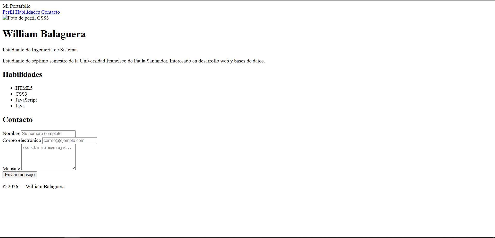
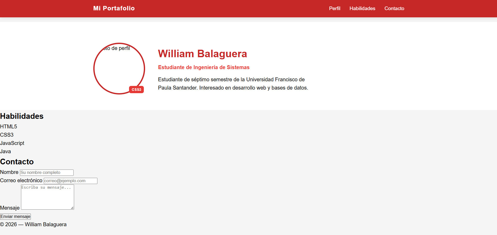
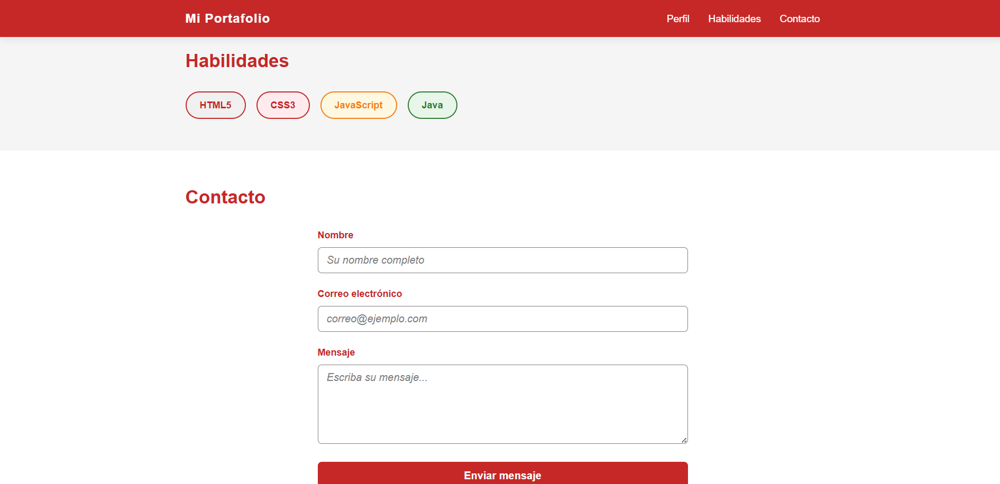

# Página de Perfil con CSS3 — William Balaguera

## Descripción
Página de perfil personal desarrollada como laboratorio de la Unidad 3
del curso de Programación Web. Implementa selectores CSS avanzados,
Box Model con box-sizing: border-box, posicionamiento fixed y absolute,
y estilos de formulario accesibles con estados :focus y :hover.

## Técnicas CSS implementadas
- Reset global y Custom Properties (variables CSS)
- Header con position: fixed
- Badge con position: absolute sobre avatar con position: relative
- Selectores BEM, hijo directo y de atributo
- Estados :hover, :focus y :active en formulario

## Cómo ejecutar
1. Clonar: `git clone https://github.com/WilliamBalaguera/balaguera-post1-u3`
2. Abrir en VS Code → clic derecho en index.html → Open with Live Server
3. Navegar a `http://localhost:5500`

## Capturas de pantalla

